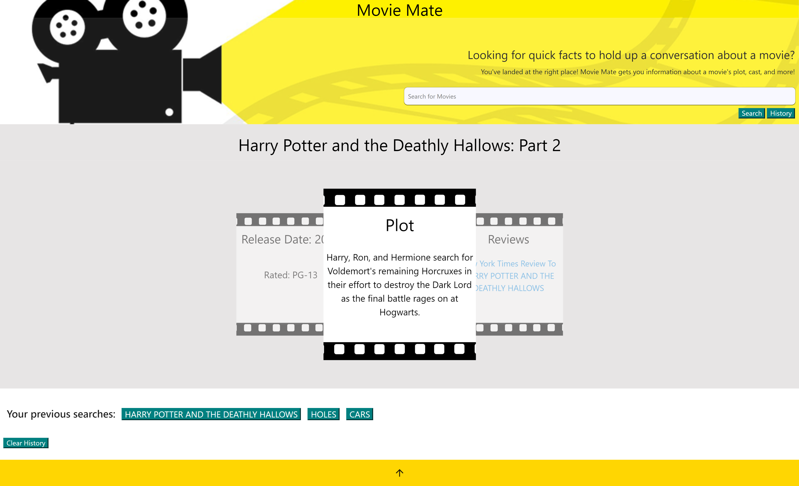

# Movie Mate

## Description

Movie Mate a search application that allows users to input a movie title and get brief information about the plot, cast, awards won, and reviews.

The app also stores the user’s previous searches so that the user can revisit them if needed.

## User Story

* AS A human
* I WANT to be able to find facts and ratings for movies
* SO THAT I can connect with conversations around me
* GIVEN I haven't seen a movie that is being talked about
* WHEN I am trying to make connections with other humans
* THEN I expect a short plot and review returned to me in order to include myself in the conversation

## Technologies Used

Movie Mate was built using:
* HTML
* Materialize CSS Library
* JavaScript
* APIs: [OMDB API](https://www.omdbapi.com/) and [NYTimes API](https://developer.nytimes.com/apis)

## Initial Mock Up

## Deployed Application

The deployed application can be found at:

## Contributors

* Mateus Valdejao - [GitHub Profile](https://github.com/MatValdejao)
* Hannah Bird - [GitHub Profile](https://github.com/Hannahbird)
* Anita Jose - [GitHub Profile](https://github.com/anitajose1)
* Duchney Derosier - [GitHub Profile](https://github.com/d2-dro)
* Lucas Blackwell - [GitHub Profile](https://github.com/Blackwell101)
* Alex Durham - [GitHub Profile](https://github.com/Alex-Durham)

## Acknowledgements

The following resources served as useful references during development:
* https://codeburst.io/know-your-http-status-a-cheat-sheet-for-http-status-codes-5fb43863e589
* 